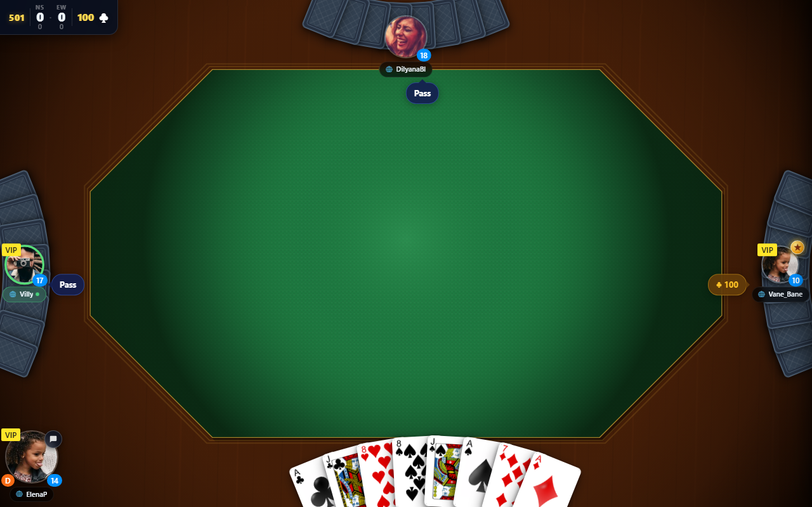

<h1 align="center">Belote — TwistedFate</h1>

<p align="center">
  A mobile-first <b>Belote Coinchée</b> card game you can play solo against AI,
  with friends over a room code, or via random matchmaking with strangers.
</p>

<p align="center">
  <a href="#"></a>
  <a href="#"></a>
  <a href="#"></a>
  <a href="#"></a>
  <a href="#"></a>
  <a href="#"></a>
  <a href="#"></a>
</p>

<p align="center">
  
</p>

---

## Table of contents

- [About](#about)
- [Features](#features)
- [Live demo](#live-demo)
- [Quick start](#quick-start)
- [Project structure](#project-structure)
- [How it works](#how-it-works)
- [Scripts](#scripts)
- [Tech stack](#tech-stack)
- [Development workflow](#development-workflow)
- [Roadmap](#roadmap)
- [Contributing](#contributing)
- [Acknowledgements](#acknowledgements)

---

## About

**Belote Coinchée** is the bidding-auction variant of the French card game Belote
— two teams of two, partners sit opposite, players bid on a contract and an
optional **coinche** (double) / **surcoinche** (redouble) raises the stakes.

This repo is a from-scratch, mobile-first web implementation of the Tunisian
flavour of the game. Built as a layered monorepo: a pure-domain rules engine,
an authoritative WebSocket server for online play, and a React/Vite PWA
client with full visual parity between solo and online modes.

> The game is designed to grow into a multi-game card platform — Belote is the
> first game, Coinche / Rami / Uno / Skyjo can be plugged in on top of the
> shared infrastructure. See [`docs/VISION.md`](docs/VISION.md).

## Features

- **Solo vs AI** — three bots with a real AI strategy (`packages/core/src/ai/strategy.ts`).
- **Friends mode** — create a 4-letter room code, share it, four players in.
- **Random matchmaking** — global FIFO queue, server auto-pairs four
  strangers and starts the game.
- **Server-authoritative gameplay** — clients can never play an illegal card;
  the server validates every action through the same rules engine the UI
  renders.
- **Reconnection** — refresh / lose signal / close the tab; the URL carries
  a `playerToken` and you re-attach to your seat without losing the round.
- **PWA / installable** — `viewport-fit=cover`, safe-area-inset-aware,
  offline-ready service worker, install prompt, home-screen icon.
- **Accessibility-conscious** — every interactive control has an
  `aria-label`, status regions are `role="status"` + `aria-live="polite"`,
  hit areas meet the WCAG 2.5.5 minimum (44 × 44), `prefers-reduced-motion`
  is honoured globally.
- **Strict TDD** — 687 tests, zero typecheck errors, every feature lands
  red-then-green with a written iteration plan and report.

## Live demo

Auto-deploys the UI to GitHub Pages on every push to `main`
([`.github/workflows`](.github/workflows)). Online play needs the
[`@belote/server`](packages/server) running somewhere reachable; locally
that's `pnpm --filter @belote/server dev` (default port `4100`).

## Quick start

### Prerequisites

| Tool | Version |
| ---- | ------- |
| Node | `>= 20` |
| pnpm | `>= 10` |

### Install

```bash
pnpm install
```

### Run the UI (solo / AI mode works without a server)

```bash
pnpm --filter ui dev
# → http://localhost:5173/twistedFate-belote/
```

### Run the online server (required for Friends + Random modes)

In a second terminal:

```bash
pnpm --filter @belote/server dev
# → http://localhost:4100  (health) + ws://localhost:4100/ws  (game)
```

The UI looks for the server at `ws://localhost:4100/ws` by default; override
with `VITE_WS_URL` in a `.env` file inside `packages/ui/`.

### Run the tests

```bash
pnpm test          # one-shot
pnpm test:watch    # watch mode
pnpm test:coverage # with coverage
```

### Other quality gates

```bash
pnpm typecheck     # tsc --build, strict, project references
pnpm lint          # ESLint 9, type-checked rules
pnpm format:check  # Prettier
```

## Project structure

pnpm workspace, six packages, strict layer separation:

```text
twistedFate---belote/
├── packages/
│   ├── core/         # @belote/core      — pure domain (no deps)
│   ├── app/          # @belote/app       — session / commands / events
│   ├── animation/    # @belote/animation — animation sequence engine
│   ├── protocol/     # @belote/protocol  — wire types + validators (zero deps)
│   ├── server/       # @belote/server    — Fastify + ws authoritative gateway
│   └── ui/           # ui                — React 19 + Vite PWA client
├── docs/
│   ├── VISION.md
│   ├── MANIFESTO.md
│   ├── PLAYBOOK.md
│   ├── REVIEW_PROTOCOL.md
│   ├── GAME_RULES.md
│   ├── UI_LAYOUT_STRUCTURE.md
│   ├── iterations/         # per-iteration plan + report
│   └── screenshots/        # smoke-run captures per iteration
├── scripts/                # smoke + screenshot Playwright scripts
└── .github/workflows/      # CI: deploy UI to GitHub Pages
```

### What lives in each package

| Package             | Responsibility                                                                    | Depends on                |
| ------------------- | --------------------------------------------------------------------------------- | ------------------------- |
| `@belote/core`      | Pure rules: `Card`, `Bid`, `Trick`, `Round`, `Game`, AI strategy, `getValidPlays` | nothing                   |
| `@belote/app`       | `GameSession`, command/event orchestration, `createPlaceBidCommand`, etc.         | `core`                    |
| `@belote/animation` | Stand-alone, framework-independent animation sequence descriptions                | nothing                   |
| `@belote/protocol`  | `ClientMessage` / `ServerMessage` discriminated unions + structural validators    | nothing                   |
| `@belote/server`    | `Room`, `RoomRegistry`, `MatchmakingQueue`, `Gateway`, Fastify + ws transport     | `core`, `app`, `protocol` |
| `ui`                | React UI: menu, lobby, table, hand, bid panel, score panel, chat, etc.            | `core`, `app`, `protocol` |

## How it works

### Solo (vs AI) mode

The UI mounts `<GameTable>` which boots a `GameSession` from `@belote/app`.
The session orchestrates rounds, dispatches bid / play commands, and emits
events. `useGameSession` projects events into UI state (hand, trick area,
score panel, thought bubbles, round summary). AI seats run inside the same
session, choosing actions via `@belote/core`'s strategy module.

### Friends / Random (online) modes

```text
┌──────────┐   ws JSON     ┌────────────────┐
│ UI (web) │ ────────────► │ @belote/server │
└──────────┘               │  ┌─────────┐   │
                           │  │  Room   │   │   owns:
                           │  │         │   │   - 4-letter code "ABCD"
                           │  │         │   │   - 4 sockets[] (seat → ws)
                           │  │         │   │   - GameSession (from @belote/app)
                           │  └─────────┘   │
                           └────────────────┘
```

- The **same** `@belote/core` rules engine the UI renders runs server-side,
  so server-side validation can never disagree with client expectations.
- The server sends each connection a `public_state` (broadcast) plus its own
  `private_state` containing the player's hand and a server-computed
  `legalCardIds[]` (via `getValidPlays`). Illegal plays can never leave the UI.
- Every join produces a stable `playerToken` so refresh / reconnect re-attaches
  the same seat without disturbing the round. The token is mirrored in the URL
  (`?room=ABCD&pid=tok_xxx`) and `localStorage`.
- Random matchmaking runs through a pure FIFO `MatchmakingQueue` —
  re-enqueue is idempotent (a refresh storm can never grow the queue past
  one slot per real client), cancellation is supported, ws-close while
  queued silently dequeues.

### Visual parity

`<GameTableView>` is a pure presentational component that takes
`GameSessionState`. Both the AI mode (`useGameSession`) and the online mode
(`useOnlineGameSession`) translate their respective sources into the same
shape, so the in-game UX is identical: same felt, same hand fan, same trick
area, same belote announcements, same round summary popup.

## Scripts

Root-level (run with `pnpm <script>`):

| Script                    | What it does                                 |
| ------------------------- | -------------------------------------------- |
| `test`                    | All packages, single run                     |
| `test:watch`              | Vitest watch mode                            |
| `test:coverage`           | Vitest with coverage                         |
| `lint` / `lint:fix`       | ESLint over the whole workspace              |
| `format` / `format:check` | Prettier write / check                       |
| `typecheck`               | `tsc --build` (project references)           |
| `build`                   | Build every package in `./packages/*`        |
| `screenshot:landscape`    | Playwright screenshot of the UI at 844 × 390 |
| `screenshot:portrait`     | Playwright screenshot of the UI at 390 × 844 |

Per-package:

| Command                              | What it does                         |
| ------------------------------------ | ------------------------------------ |
| `pnpm --filter ui dev`               | Start the Vite dev server for the UI |
| `pnpm --filter ui build`             | Production build for GitHub Pages    |
| `pnpm --filter ui preview`           | Serve the production build locally   |
| `pnpm --filter @belote/server dev`   | Start the WS server with `tsx watch` |
| `pnpm --filter @belote/server start` | Start the WS server (no watch)       |

## Tech stack

- **Language** — TypeScript 5.9, strict mode, project references
- **UI** — React 19, Vite 7, CSS Modules, `@radix-ui/themes`
- **Animations / motion** — bespoke (CSS transforms + transitions; PixiJS-free)
- **Server** — Node 20+, Fastify 5, `ws` 8, `tsx`
- **Testing** — Vitest 4, `@testing-library/react`, jsdom; integration tests
  spin up real `ws` clients
- **Linting / formatting** — ESLint 9, `typescript-eslint` (strict-type-checked plus stylistic), Prettier
- **Tooling** — pnpm workspaces, Playwright (smoke + screenshots)
- **PWA** — manifest, service worker, install-prompt component, safe-area-aware

## Development workflow

The project follows a non-negotiable iteration discipline (see
[`docs/PLAYBOOK.md`](docs/PLAYBOOK.md) and
[`docs/REVIEW_PROTOCOL.md`](docs/REVIEW_PROTOCOL.md)):

1. **Plan** — write `docs/iterations/iteration-NNN-plan.md` first (scope,
   architecture, TDD order, files to touch, validation criteria).
2. **TDD red** — write failing tests for the behaviour you want.
3. **Implement minimum code** to turn the tests green.
4. **Refactor** — keep tests green.
5. **Four checks must pass** — `pnpm test`, `pnpm typecheck`, `pnpm lint`,
   `pnpm format:check`.
6. **Document** — write `docs/iterations/iteration-NNN-report.md` (TDD trail,
   files, validation results, design notes, carryforward).
7. **Commit** — one iteration, one feat commit; reference the iteration in
   the message.

Browse `docs/iterations/` to see how every feature was built.

## Roadmap

Recent landed iterations:

| #   | Title                                                    | Highlights                                                                                         |
| --- | -------------------------------------------------------- | -------------------------------------------------------------------------------------------------- |
| 012 | Coinchée rules + live contract UX + belote announcements | Coinche / surcoinche, live score panel, belote/rebelote                                            |
| 013 | Online multiplayer (Friends mode) end-to-end             | New `@belote/protocol`, `@belote/server`; ws transport; reconnection; visual parity                |
| 014 | Random matchmaking (auto-pair 4 strangers)               | Pure FIFO queue, `find_random` / `match_found` protocol, queue UI                                  |
| 015 | Menu UI device polish                                    | Fluid typography, safe-area insets, 44×44 hit targets, a11y attributes, reduced-motion             |
| 016 | Board UI device polish                                   | Same treatment for `ScorePanel`, `BidPanel`, `ChatButton`, `ChatPanel`, `GameOver`, `RoundSummary` |

Open backlog (rough priority order):

- [ ] **Ranked mode** — last disabled button on the mode-select screen.
- [ ] **AI fill in Friends rooms** — let a 2- or 3-friend party play with bots
      filling empty seats.
- [ ] **Dev preview / screen viewer** — render every screen × variant in
      isolation without starting a real game.
- [ ] **Project-wide lint hygiene** — clear pre-existing typed-rule violations
      in `BidPanel.tsx` and friends.
- [ ] **Pixel-diff regression suite** — wire the existing
      `scripts/screenshot.mjs` into CI.
- [ ] **Production deployment for the server** — currently local-dev only.

## Contributing

Contributions follow a strict iteration / TDD discipline. Read
[CONTRIBUTING.md](CONTRIBUTING.md) before opening a PR — it covers:

- The five-phase iteration lifecycle (plan → red → green → refactor → report)
- TypeScript / React / CSS / test conventions and naming rules
- The package layer rules and dependency direction
- Branch / commit / PR expectations and the four-check quality bar

For background on the four-role review framework (PO → Architect → Reviewer
→ Tester), see [`docs/REVIEW_PROTOCOL.md`](docs/REVIEW_PROTOCOL.md). For the
long-term platform vision (multi-game card platform), see
[`docs/VISION.md`](docs/VISION.md).

## Acknowledgements

- The Tunisian Belote rules followed in `docs/GAME_RULES.md` are the same
  rules used in everyday play across the Maghreb — a Coinchée variant of the
  French Belote.
- Card images are public-domain SVGs in `packages/ui/public/cards/`.
